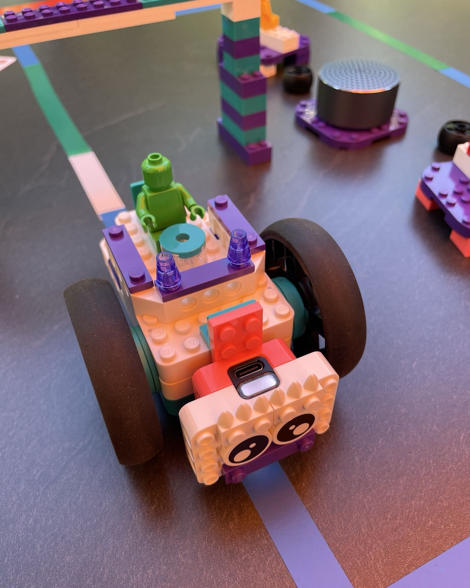
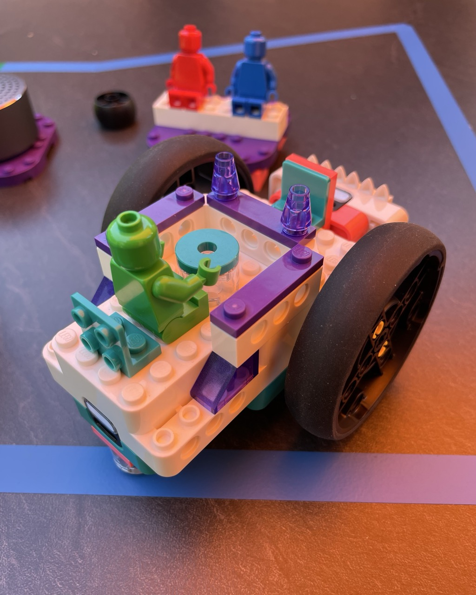
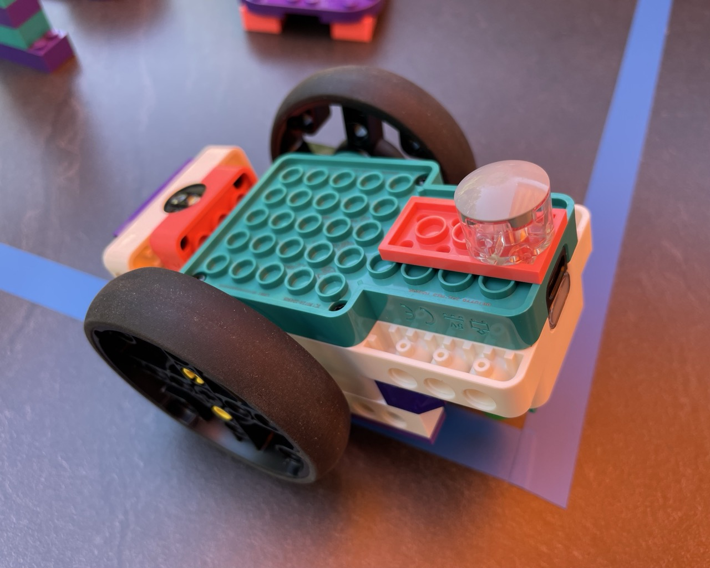
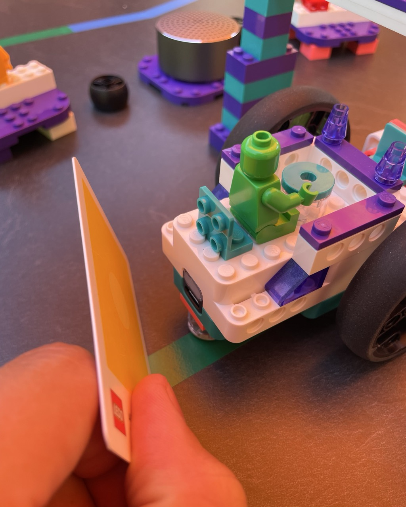
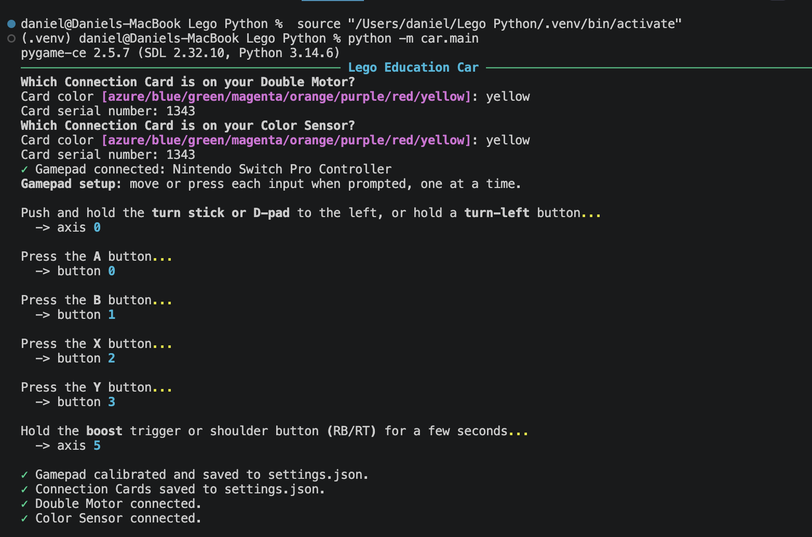
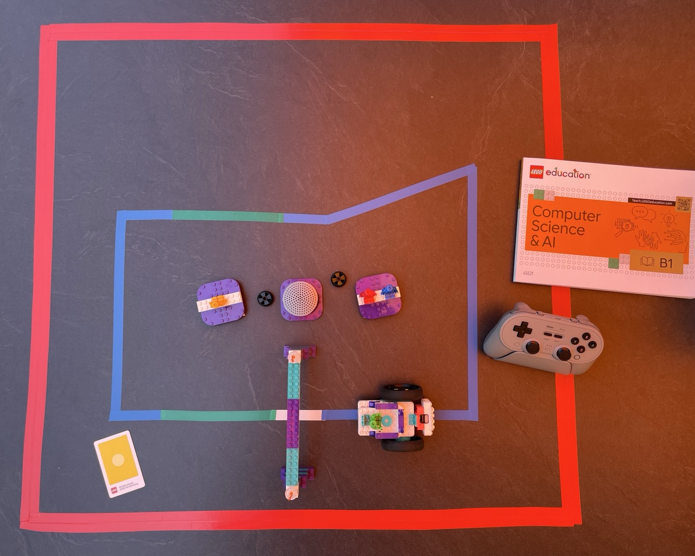
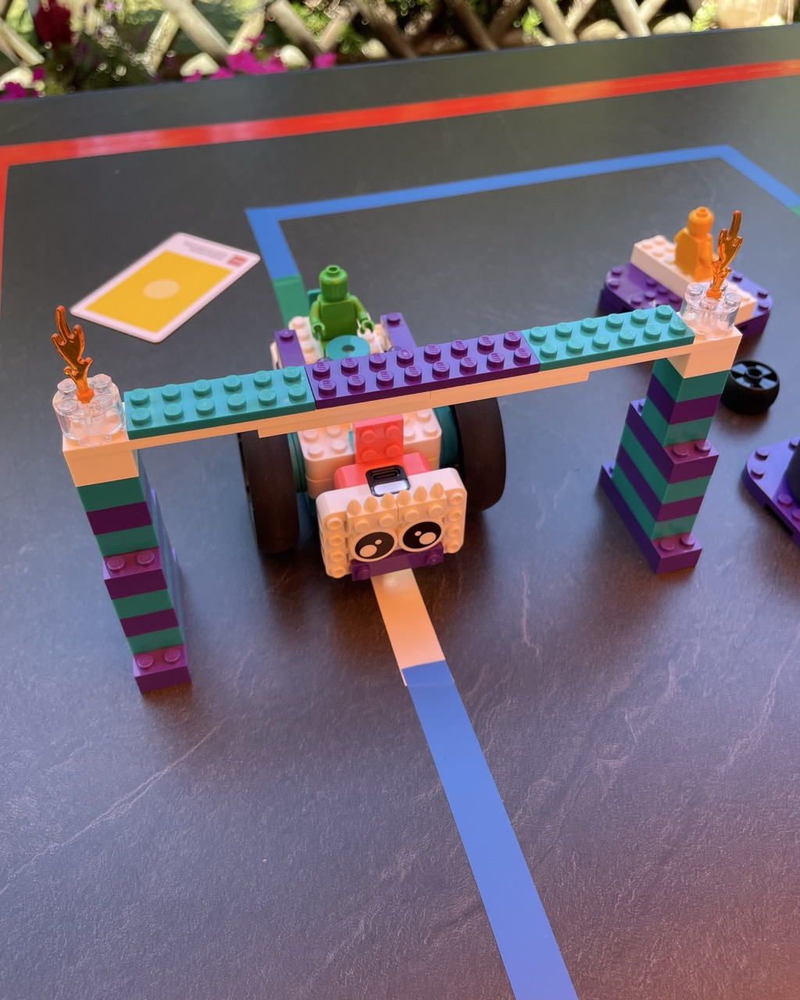
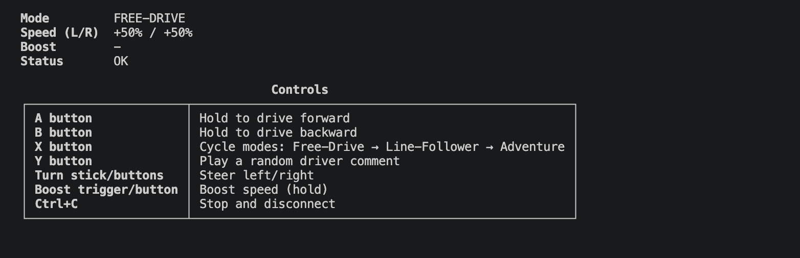
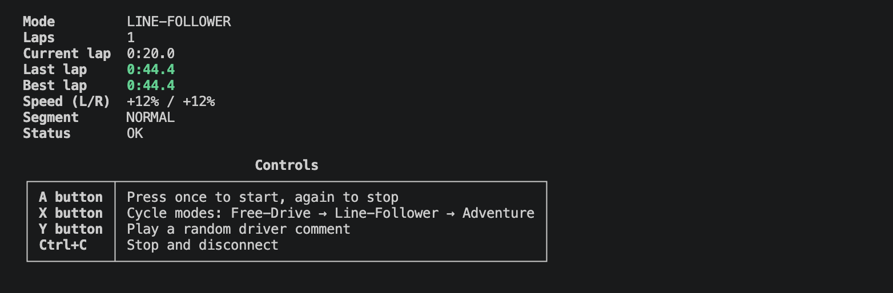

# LEGO Education Car

Control your LEGO Double Motor car with a gamepad, follow a colored-tape track autonomously,
or roam an arena solo. Three drive modes, sounds, voice comments, lap counter, live dashboard.

[](https://www.python.org/)
[](LICENSE)


<p align="center">
  <a href="instructions/car-front.jpeg"></a>&nbsp;&nbsp;<a href="instructions/car-back.jpeg"></a>
</p>

---

## Hardware

The car's physical build is based on lesson B101 *Castle Quest* from the
[LEGO Education Computer Science & AI](https://teach.legoeducation.com/de-de/computer-science/lesson/castle-quest/building-instructions) B1 curriculum,
extended with a Bluetooth gamepad, speaker, and custom Python software.

| Part | Role |
| --- | --- |
| LEGO Education Double Motor | Drives the car |
| LEGO Education Color Sensor | Reads the tape (mounted facing down at the front) |
| Bluetooth or USB gamepad | Your controller |
| Bluetooth speaker | Set as default audio output |

<p align="center">
  <a href="instructions/car-bottom.jpeg"></a>
</p>

---

## Getting Started

### 1. Get the code

```bash
git clone https://github.com/goetz-daniel/lego-car.git
cd lego-car
```

### 2. Install Python 3.14+

**macOS / Linux:**

```bash
brew install python@3.14
```

**Windows:**

```bat
winget install Python.Python.3.14
```

### 3. Install and run

**macOS / Linux:**

```bash
python3.14 -m venv .venv
source .venv/bin/activate
pip install -r requirements.txt
python -m car.main
```

**Windows:**

```bat
py -3.14 -m venv .venv
.venv\Scripts\activate
pip install -r requirements.txt
python -m car.main
```

On first run you'll be asked for your **Connection Card** (the code printed on the hub and sensor)
and a quick gamepad calibration — both saved automatically, never asked again.

<p align="center">
  <a href="instructions/car-card.jpeg"></a>
</p>

<p align="center">
  <a href="instructions/setup-terminal.png"></a>
</p>

---

## Track Colors

Lay matte electrical tape on the floor in four colors:

| Color | Meaning |
| --- | --- |
| Blue | Normal path |
| Green | Speed boost — faster as long as it's seen |
| White | Finish line — one lap per crossing |
| Red | Boundary — stops/redirects the car |

No gaps or overlaps between strips. One white strip only. Lay red boundary as a double-width strip so it's always detected. If a color isn't recognized, adjust the `*_color` value in `car/settings.json`.

<p align="center">
  <a href="instructions/car-track.jpeg"></a>
</p>

<p align="center">
  <a href="instructions/car-finish-line.jpeg"></a>
</p>

---

## Controls

### Free-Drive

You steer. Crossing the red boundary locks the wheels until you lift the car clear.

| Input | Action |
| --- | --- |
| A | Hold to drive forward |
| B | Hold to drive backward |
| Left stick | Steer |
| Trigger | Boost |
| X | Next mode |
| Y | Random driver comment |
| Ctrl+C | Quit |

<p align="center">
  <a href="instructions/free-drive-terminal.png"></a>
</p>

### Line-Follower

Press X then A. Must see blue or white to start. Follows the tape straight; if the line is
lost it scans left and right to find it again. Stops after two failed scans and waits.

### Adventure

Press X then A. Drop the car inside a red-tape border — it drives itself, bouncing off the
boundary and picking new directions randomly.

Both modes share the same controls:

| Input | Action |
| --- | --- |
| A | Start / stop |
| X | Next mode |
| Y | Random driver comment |
| Ctrl+C | Quit |

<p align="center">
  <a href="instructions/line-follower-terminal.png"></a>
</p>

---

## Status Light

| Light | Meaning |
| --- | --- |
| Green | Free-drive |
| Blue | Line-follower running |
| Yellow | Adventure running |
| Orange | Boosting |
| Red, blinking | Blocked / searching / redirecting |

---

## Settings & Libraries

All options in `car/settings.json`, created automatically on first run.

| Library | What it does |
| --- | --- |
| [legoeducation](https://github.com/LEGO/LEGOEducation) | Controls the LEGO hubs |
| [pygame-ce](https://github.com/pygame-community/pygame-ce) | Reads the gamepad, plays sounds |
| [rich](https://github.com/Textualize/rich) | Live terminal dashboard |

---

## Development

```bash
pip install -r requirements-dev.txt
python -m pytest
ruff check car/ tests/ && ruff format car/ tests/
pymarkdown --config pyproject.toml scan README.md AGENTS.md
```
